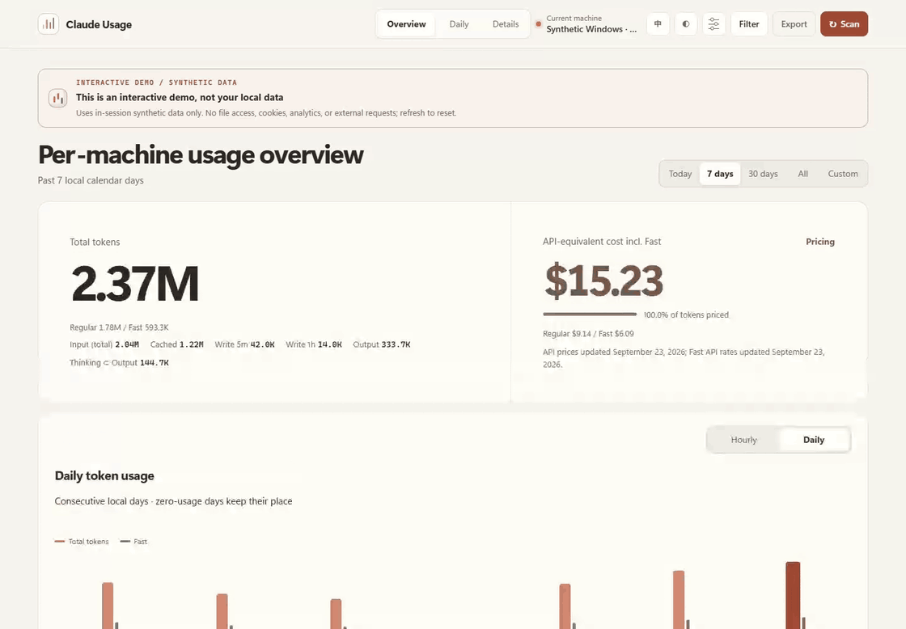

<div align="center">

# claude-usage

**A clear view of your Claude usage.**

*From Windows and WSL to every day, project, and task.*

[Live demo](https://zjay26.github.io/claude-usage/?lang=en) · [Windows x64](https://github.com/zJay26/claude-usage/releases/latest/download/claude-usage-windows-amd64.exe) · [Linux x64](https://github.com/zJay26/claude-usage/releases/latest/download/claude-usage-linux-amd64) · [macOS Apple Silicon](https://github.com/zJay26/claude-usage/releases/latest/download/claude-usage-darwin-arm64) · [All downloads](#download-and-start) · English / [简体中文](README.md)

[](https://github.com/zJay26/claude-usage/actions/workflows/ci.yml)
[](https://github.com/zJay26/claude-usage/releases/latest)
[](https://go.dev/)
[](LICENSE)

</div>



Overview → a 90-minute range → hourly drilldown → daily calendar → projects and task trees → search → Fast + model filters → CSV export → Windows / WSL sources → model and cache pricing → display settings, themes and language.

[Try the interactive demo](https://zjay26.github.io/claude-usage/?lang=en) · [Full-resolution video](docs/media/claude-usage-demo-en.mp4) · [Recording notes](docs/media/README.md)

> A 98-second tour across 14 chapters, recorded directly from the current dashboard using synthetic data at original speed. A smooth pointer, gradual search input, and reading pauses make each step visible. The online demo does not read local files, set cookies, or collect usage data.

## From today's total to an individual task

**claude-usage is a local dashboard for Claude token usage.** Start with totals, trends and API-equivalent costs, then follow a date, hour, model, project or task to understand where the tokens went. Windows automatically combines local and WSL transcripts, counting mirrored requests once.

Ask “How much did I use today?” or “What did these 90 minutes, this project, or this task tree consume?” Inspect ordinary input, cache reads, both cache-write lifetimes, output and thinking, including compaction, Advisor and subagents. Pricing coverage keeps unknown prices visible.

One binary, with no Node.js, database service, account sign-in or API key needed. The warm dashboard supports Chinese, English, light and dark themes, and mobile screens. Statistics stay on your computer; conversation bodies and tool output are not stored.

## Download and start

Current release: **[v0.1.2](https://github.com/zJay26/claude-usage/releases/tag/v0.1.2)**. The default address is **[http://127.0.0.1:43190](http://127.0.0.1:43190)**. Links always point to the latest stable release; see the [release notes](docs/releases/v0.1.2.md).

| System | amd64 / x64 | arm64 |
|---|---|---|
| Windows | [x64 binary](https://github.com/zJay26/claude-usage/releases/latest/download/claude-usage-windows-amd64.exe) | [ARM64 binary](https://github.com/zJay26/claude-usage/releases/latest/download/claude-usage-windows-arm64.exe) |
| Linux / WSL | [x64 binary](https://github.com/zJay26/claude-usage/releases/latest/download/claude-usage-linux-amd64) | [ARM64 binary](https://github.com/zJay26/claude-usage/releases/latest/download/claude-usage-linux-arm64) |
| macOS | [Intel binary](https://github.com/zJay26/claude-usage/releases/latest/download/claude-usage-darwin-amd64) | [Apple Silicon binary](https://github.com/zJay26/claude-usage/releases/latest/download/claude-usage-darwin-arm64) |

### Windows

For ARM64, replace `amd64` in the URL with `arm64`:

```powershell
Invoke-WebRequest https://github.com/zJay26/claude-usage/releases/latest/download/claude-usage-windows-amd64.exe -OutFile claude-usage.exe
.\claude-usage.exe --lang en serve
```

### Linux / WSL

```bash
curl -fL https://github.com/zJay26/claude-usage/releases/latest/download/claude-usage-linux-amd64 -o claude-usage
chmod +x claude-usage
./claude-usage --lang en serve
```

### macOS

For Intel, replace `arm64` in the URL with `amd64`:

```bash
curl -fL https://github.com/zJay26/claude-usage/releases/latest/download/claude-usage-darwin-arm64 -o claude-usage
chmod +x claude-usage
./claude-usage --lang en serve
```

macOS binaries are not Developer-ID signed or notarized, so macOS may require you to allow them manually. Every release includes [SHA256SUMS](https://github.com/zJay26/claude-usage/releases/latest/download/SHA256SUMS); verify the matching asset with `Get-FileHash`, `sha256sum`, or `shasum -a 256`.

### Background startup and updates

Open **http://127.0.0.1:43190/?lang=en** for the English dashboard. To enable login startup, explicitly run `.\claude-usage.exe --lang en install` on Windows or `./claude-usage --lang en install` on Linux/macOS. Installation uses the current user's Windows startup entry, a systemd user service on Linux/WSL, or a macOS LaunchAgent.

**Software updates** in the footer lets you check releases, choose a download directory and install an update. Downloads use SHA-256 verification, backups and failure recovery; automatic checks never install updates. `uninstall` removes the service while retaining statistics. `uninstall --purge` also removes application state.

**Existing preferences remain effective.** An upgrade preserves a previously saved port. To move an existing v0.1.0 installation to 43190, stop its service, change `port` in the state directory's `config.json`, and restart. New visits and CLI sessions default to Chinese. The dashboard remembers a manually selected language; use `?lang=en` for English, and `--lang en` or `CLAUDE_USAGE_LANG=en` for the CLI.

## Everyday tools in one dashboard

| Capability | What you can do |
|---|---|
| Overview and precise ranges | Query today, 7 days, 30 days, all time or any minute interval, with corresponding estimated costs |
| Calendar and hourly drilldown | Select a day, inspect hourly usage and compare model composition |
| Projects and task trees | Explore models, projects, sources and tasks; expand subagents and distinguish own usage from subtree totals |
| Search, filter and export | Search titles, projects or Sessions, combine date/model/Fast/source filters and export the selected scope as JSON / CSV |
| Windows + WSL | Discover distributions, inspect each source, add directories and control startup; deduplicate mirrored requests globally |
| Claude metering and pricing | Separate input, cache reads, 5-minute/1-hour writes, output and thinking; see the unpriced share |
| Local model pricing | Inspect built-in rates, map unknown Claude names or enter custom prices, and recalculate at query time |
| Display preferences | Chinese default, English toggle, light/dark themes, type size, density, reduced motion and mobile layouts |
| Continuous indexing | Follow new usage, retain collected history after source deletion, and ask before rebuilding rewritten logs |

<details>
<summary>Desktop, source management and mobile screenshots (synthetic data)</summary>


</details>


## Accounting

- Reads `~/.claude/projects`, or `CLAUDE_CONFIG_DIR`, plus manually added directories. Windows discovers user WSL distributions automatically, excludes Docker distributions and may start stopped distributions. Both behaviors are configurable under **Log sources**; discovery and WSL scanning use hidden processes with timeouts.
- Accepts Claude models and recognized Bedrock/Vertex identifiers; excludes third-party models and `<synthetic>` records. Main sessions, subagents and official transcript copies are supported.
- Request and message identities deduplicate content blocks, copied sessions and Windows/WSL mirrors globally. Late identity information can join existing records. Multiple selected sources form a union, never a sum of copies.
- **Input = uncached input + cache reads + cache writes. Total = Input + Output.** Thinking is part of Output. Cache writes track 5-minute, 1-hour and unknown lifetimes separately.
- Valid `usage.iterations` replaces top-level usage, including compaction and Advisor calls. Iteration-specific models are accounted for separately. Later complete usage can enrich the original request. Conflicts are diagnosed without silently replacing confirmed counters.
- Checks for changes every 30 seconds and performs a fallback scan every 10 minutes. Transactional cursors support partial lines, large content, restarts and idempotent scans. Deleted files do not erase collected history. Rewritten or truncated history requires explicit rebuild approval.
- Task trees use explicit session metadata and subagent directories. A message's `parentUuid` is not a parent task. Missing parents leave independent tasks.

The dashboard includes overview/daily/details views, minute ranges, calendars and hourly drilldowns, model/project/task breakdowns, search, combined filters, task trees, JSON/CSV exports, English/Chinese, light/dark themes, font and density settings, reduced motion and mobile layouts.

## Estimated cost

Costs are **token-equivalent estimates at current public API prices**. They are neither subscription deductions nor actual bills, and do not reconstruct historical pricing. The bundled catalog was checked on **2026-09-23** and includes Opus 5.5 and Sonnet 5.

Uncached input, cache reads, both write lifetimes and output use separate rates and fixed-point nanodollars. Explicit Fast usage follows supported official Fast rates. Unknown models, unknown cache lifetimes and unavailable legacy long-context tiers remain visible as unpriced tokens. Newer models use current full-context rates; legacy Sonnet 4/4.5 requests over 200K are not assigned obsolete historical prices. Local custom prices and aliases apply at query time.

Sources: [official pricing](https://platform.claude.com/docs/en/about-claude/pricing), [prompt caching](https://platform.claude.com/docs/en/build-with-claude/prompt-caching), [iteration accounting](https://platform.claude.com/docs/en/about-claude/models/optimizing-for-cost-and-intelligence).

## Privacy and isolation

No Claude configuration changes or credential collection. Conversation bodies, thinking text and tool outputs are discarded during streaming parsing and never saved. The local database keeps counters, identities, timestamps, models, project paths, titles, relationships and source metadata. Paths and titles can be sensitive; review exports before sharing.

The server only binds to loopback. UI assets are embedded, with no telemetry. GitHub is contacted for update checks/downloads. All sources use the timezone saved when the database is first created.

| Variable | Purpose |
| --- | --- |
| `CLAUDE_USAGE_HOME` | Dedicated application state directory |
| `CLAUDE_USAGE_TIMEZONE` | Timezone for a new database, e.g. `Europe/London` |
| `CLAUDE_USAGE_LANG` | CLI language, `en` or `zh-CN` |
| `CLAUDE_CONFIG_DIR` | Local Claude transcript root |

Defaults: `%LOCALAPPDATA%\claude-usage` on Windows; `$XDG_DATA_HOME/claude-usage` or `~/.local/share/claude-usage` on Linux; `~/Library/Application Support/claude-usage` on macOS. Binary names, services, port, database, update URLs and browser storage are independent from codex-usage.

## Development

Useful commands: `serve`, `scan --json`, `summary --json`, `doctor`, `update check`, `update install`, and `help` for all options.

Run `go test ./...`, `go vet ./...`, then `go build -trimpath -o claude-usage ./cmd/claude-usage`. Install test dependencies with `npm ci` and `npx playwright install chromium`, then run `CLAUDE_USAGE_BIN=./claude-usage npm test` (set the environment variable with PowerShell on Windows). Build before Playwright to exclude first-build latency.

`npm run build:demo` generates the synthetic-only static demo. With FFmpeg installed, `npm run capture:media` records Chinese/English GIFs, MP4 videos, screenshots and chapter audit files. `npm run capture:screenshots` captures still images separately. Build scripts produce Windows/Linux/macOS binaries for amd64/arm64. CI includes Linux race checks and native macOS installation, restart and uninstallation tests.

Existing `/api/v1` query, pricing, export, rescan and update APIs remain available. `GET/PUT /api/v1/sources` manages discovery and directories. Repeat `home=...` for source unions. Other filters include `since`, `until`, `date`, `model`, `project`, `source`, `agent_type`, `mode`, `session_id` and `q`. Dashboard pricing uses `cost_basis=claude_fast_weighted`; `current_standard_api_text_token_prices` provides the compatible Standard comparison. Exports include cache lifetimes, iteration types and source associations, without estimated charges. See [accounting](docs/accounting.md) and [validation](docs/validation.md).

## Attribution

An independent MIT project derived from [zJay26/codex-usage](https://github.com/zJay26/codex-usage), commit `e0ca1f916097aff4a12f73e54152f9480655c9e6`. The Go/SQLite, embedded dashboard, installer and updater framework is retained; Claude parsing, the request ledger, source management and pricing are implemented here. Original MIT notices are preserved in [LICENSE](LICENSE) and [THIRD_PARTY_NOTICES.md](THIRD_PARTY_NOTICES.md). Not an official Anthropic product.
