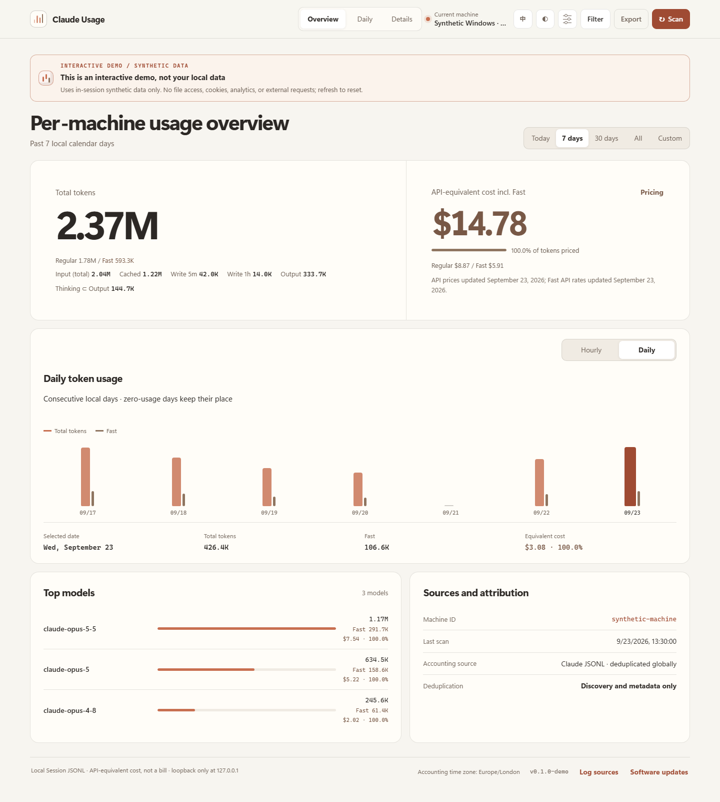

# Claude Usage

[中文](README.md) · [Download](https://github.com/zJay26/claude-usage/releases/latest) · [Synthetic demo](https://zjay26.github.io/claude-usage/)

A local Claude token dashboard for Windows, WSL, Linux and macOS. One binary embeds the UI and SQLite. No Node.js runtime, sign-in or API key is required.

## Run

Download the matching OS/architecture from Releases and verify it against `SHA256SUMS`. On Windows run `claude-usage-windows-amd64.exe serve`; on Linux/macOS make the binary executable with `chmod +x`, then run it with `serve`. Open **http://127.0.0.1:43191**.

`serve` runs in the foreground without installing startup entries. To enable startup explicitly, run `install`: this uses a Windows user startup entry, a Linux/WSL systemd user service, or a macOS LaunchAgent. `uninstall` retains statistics; `uninstall --purge` also removes this tool's dedicated state directory.

Other commands: `scan --json`, `summary --json`, `doctor`, `version`, `update check`, and `update install`. Run `help` for all options. The dashboard also offers update checks, a configurable download directory, SHA-256 verification, backup and rollback. Checking never automatically installs an update.

## Accounting

- Reads `~/.claude/projects`, or `CLAUDE_CONFIG_DIR`, plus manually added directories. Windows discovers user WSL distributions automatically, excludes Docker distributions and may start stopped distributions. Both behaviors are configurable under **Log sources**; discovery and WSL scanning use hidden processes with timeouts.
- Accepts Claude models and recognized Bedrock/Vertex identifiers; excludes third-party models and `<synthetic>` records. Main sessions, subagents and official transcript copies are supported.
- Request and message identities deduplicate content blocks, copied sessions and Windows/WSL mirrors globally. Late identity information can join existing records. Multiple selected sources form a union, never a sum of copies.
- **Input = uncached input + cache reads + cache writes. Total = Input + Output.** Thinking is part of Output. Cache writes track 5-minute, 1-hour and unknown lifetimes separately.
- Valid `usage.iterations` replaces top-level usage, including compaction and Advisor calls. Iteration-specific models are accounted for separately. Later complete usage can enrich the original request. Conflicts are diagnosed without silently replacing confirmed counters.
- Checks for changes every 30 seconds and performs a fallback scan every 10 minutes. Transactional cursors support partial lines, large content, restarts and idempotent scans. Deleted files do not erase collected history. Rewritten or truncated history requires explicit rebuild approval.
- Task trees use explicit session metadata and subagent directories. A message's `parentUuid` is not a parent task. Missing parents leave independent tasks.

The dashboard includes overview/daily/details views, minute ranges, calendars and hourly drilldowns, model/project/task breakdowns, search, combined filters, task trees, JSON/CSV exports, English/Chinese, light/dark themes, font and density settings, reduced motion and mobile layouts.

## Estimated cost

Costs are **token-equivalent estimates at current public API prices**. They are neither subscription deductions nor actual bills, and do not reconstruct historical pricing. The bundled catalog was checked on **2026-09-23** and includes Opus 5.5 and Sonnet 5.

Uncached input, cache reads, both write lifetimes and output use separate rates and fixed-point nanodollars. Explicit Fast usage follows supported official Fast rates. Unknown models, unknown cache lifetimes and unavailable legacy long-context tiers remain visible as unpriced tokens. Newer models use current full-context rates; legacy Sonnet 4/4.5 requests over 200K are not assigned obsolete historical prices. Local custom prices and aliases apply at query time.

Sources: [official pricing](https://platform.claude.com/docs/en/about-claude/pricing), [prompt caching](https://platform.claude.com/docs/en/build-with-claude/prompt-caching), [iteration accounting](https://platform.claude.com/docs/en/about-claude/models/optimizing-for-cost-and-intelligence).

## Privacy and isolation

No Claude configuration changes or credential collection. Conversation bodies, thinking text and tool outputs are discarded during streaming parsing and never saved. The local database keeps counters, identities, timestamps, models, project paths, titles, relationships and source metadata. Paths and titles can be sensitive; review exports before sharing.

The server only binds to loopback. UI assets are embedded, with no telemetry. GitHub is contacted for update checks/downloads. All sources use the timezone saved when the database is first created.

| Variable | Purpose |
| --- | --- |
| `CLAUDE_USAGE_HOME` | Dedicated application state directory |
| `CLAUDE_USAGE_TIMEZONE` | Timezone for a new database, e.g. `Europe/London` |
| `CLAUDE_USAGE_LANG` | CLI language, `en` or `zh-CN` |
| `CLAUDE_CONFIG_DIR` | Local Claude transcript root |

Defaults: `%LOCALAPPDATA%\claude-usage` on Windows; `$XDG_DATA_HOME/claude-usage` or `~/.local/share/claude-usage` on Linux; `~/Library/Application Support/claude-usage` on macOS. Binary names, services, port, database, update URLs and browser storage are independent from codex-usage.

## Development

Run `go test ./...`, `go vet ./...`, then `go build -trimpath -o claude-usage ./cmd/claude-usage`. Install test dependencies with `npm ci` and `npx playwright install chromium`, then run `CLAUDE_USAGE_BIN=./claude-usage npm test` (set the environment variable with PowerShell on Windows). Build before Playwright to exclude first-build latency.

`npm run build:demo` generates the synthetic-only static demo. `npm run capture:media` captures synthetic screenshots. Build scripts produce Windows/Linux/macOS binaries for amd64/arm64. CI includes Linux race checks and native macOS installation, restart and uninstallation tests.

Existing `/api/v1` query, pricing, export, rescan and update APIs remain available. `GET/PUT /api/v1/sources` manages discovery and directories. Repeat `home=...` for source unions. Other filters include `since`, `until`, `date`, `model`, `project`, `source`, `agent_type`, `mode`, `session_id` and `q`. Dashboard pricing uses `cost_basis=claude_fast_weighted`; `current_standard_api_text_token_prices` provides the compatible Standard comparison. Exports include cache lifetimes, iteration types and source associations, without estimated charges. See [accounting](docs/accounting.md) and [validation](docs/validation.md).

## Attribution

An independent MIT project derived from [zJay26/codex-usage](https://github.com/zJay26/codex-usage), commit `e0ca1f916097aff4a12f73e54152f9480655c9e6`. The Go/SQLite, embedded dashboard, installer and updater framework is retained; Claude parsing, the request ledger, source management and pricing are implemented here. Original MIT notices are preserved in [LICENSE](LICENSE) and [THIRD_PARTY_NOTICES.md](THIRD_PARTY_NOTICES.md). Not an official Anthropic product.
