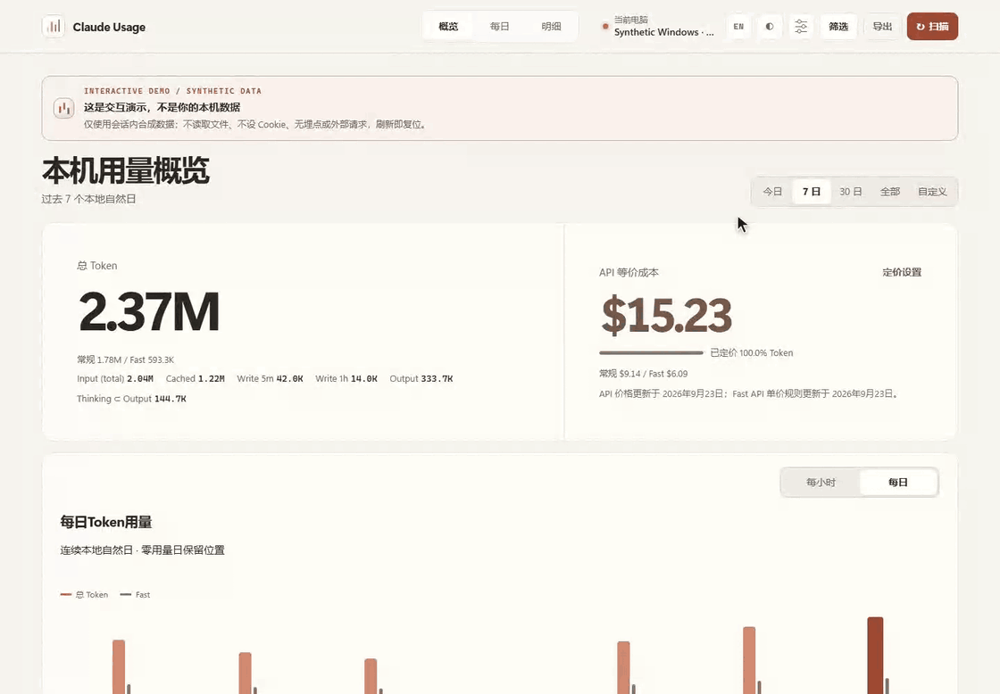
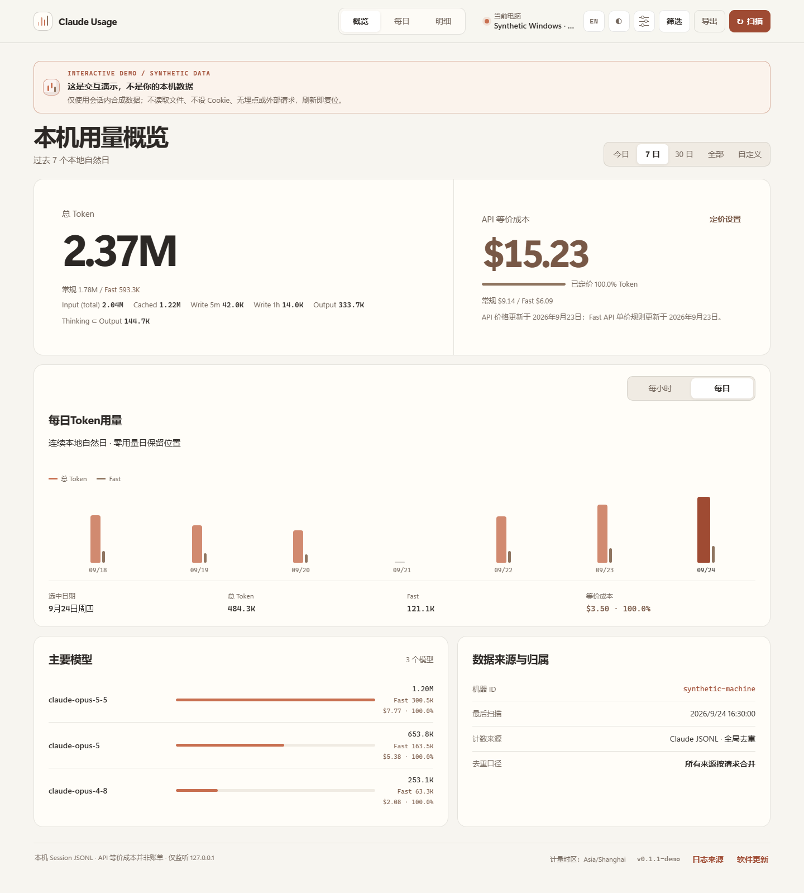
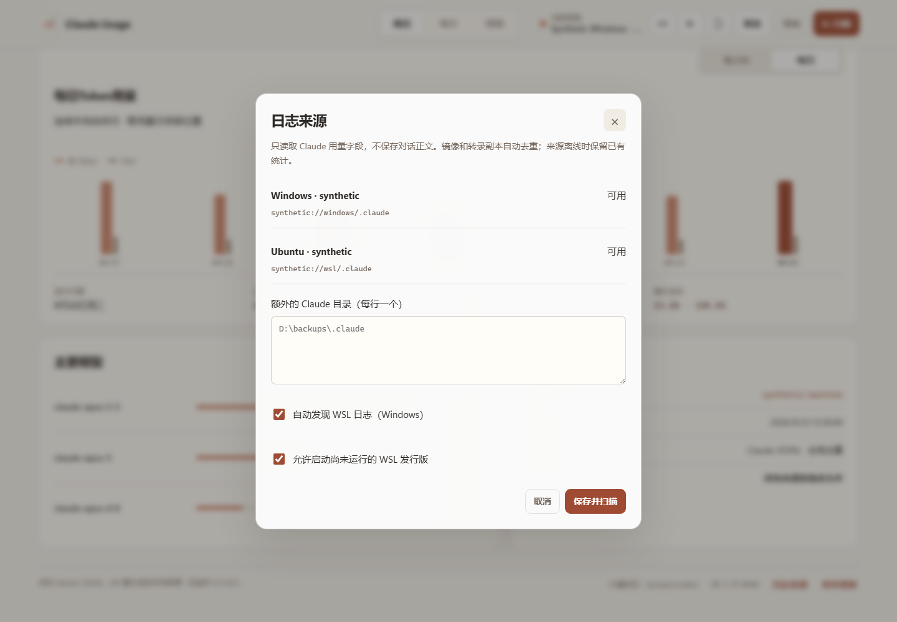
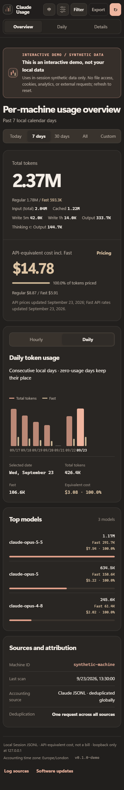

<div align="center">

# claude-usage

**让 Claude 用量一目了然。**

*从 Windows 与 WSL，到每一天、每个项目、每一次任务。*

[在线体验](https://zjay26.github.io/claude-usage/) · [Windows x64](https://github.com/zJay26/claude-usage/releases/latest/download/claude-usage-windows-amd64.exe) · [Linux x64](https://github.com/zJay26/claude-usage/releases/latest/download/claude-usage-linux-amd64) · [macOS Apple Silicon](https://github.com/zJay26/claude-usage/releases/latest/download/claude-usage-darwin-arm64) · [全部下载](#下载与开始使用) · [English](README.en.md) / 简体中文

[](https://github.com/zJay26/claude-usage/actions/workflows/ci.yml)
[](https://github.com/zJay26/claude-usage/releases/latest)
[](https://go.dev/)
[](LICENSE)

</div>



概览 → 90 分钟用量查询 → 小时下钻 → 每日月历 → 项目与任务树 → 搜索 → Fast + 模型组合筛选 → CSV 导出 → Windows / WSL 来源 → 模型与缓存定价 → 显示设置、明暗主题与中英切换。

[亲手试用在线 Demo](https://zjay26.github.io/claude-usage/) · [高清演示视频](docs/media/claude-usage-demo-zh.mp4) · [录制说明](docs/media/README.md)

> 约 99 秒、14 个展示环节，直接录制当前界面，使用合成数据，按原速播放。光标平滑移动、搜索逐字输入，关键画面留有阅读停顿。在线 Demo 不读取本机文件、不设 Cookie，也不采集使用数据。

## 从今天的总量，看到每一次任务

**claude-usage 是一个本地 Claude 用量仪表盘。** 打开就能看总量、趋势和 API 等价费用，再沿着日期、小时、模型、项目或任务，找到用量来自哪里。Windows 自动汇总本机与 WSL 日志，镜像里的同一请求只计算一次。

既能查“今天用了多少”，也能查“刚才这 90 分钟、这个项目、这棵任务树用了多少”。输入、缓存读取、不同期限的缓存写入、输出与 Thinking 分开呈现；压缩、Advisor 和子代理也进入同一套统计。费用有定价覆盖率，未知价格不会被算成免费。

一个程序即可运行，无需 Node.js、数据库服务、账号登录或 API Key。默认中文，暖色界面，同时支持英文、明暗主题与手机布局。统计保存在当前电脑，不保存对话正文或工具输出。

## 下载与开始使用

当前版本 **[v0.1.2](https://github.com/zJay26/claude-usage/releases/tag/v0.1.2)**，默认地址 **[http://127.0.0.1:43190](http://127.0.0.1:43190)**。下载链接始终指向最新稳定版，更新内容见 [发布说明](docs/releases/v0.1.2.md)。

| 系统 | amd64 / x64 | arm64 |
|---|---|---|
| Windows | [x64 程序](https://github.com/zJay26/claude-usage/releases/latest/download/claude-usage-windows-amd64.exe) | [ARM64 程序](https://github.com/zJay26/claude-usage/releases/latest/download/claude-usage-windows-arm64.exe) |
| Linux / WSL | [x64 程序](https://github.com/zJay26/claude-usage/releases/latest/download/claude-usage-linux-amd64) | [ARM64 程序](https://github.com/zJay26/claude-usage/releases/latest/download/claude-usage-linux-arm64) |
| macOS | [Intel 程序](https://github.com/zJay26/claude-usage/releases/latest/download/claude-usage-darwin-amd64) | [Apple Silicon 程序](https://github.com/zJay26/claude-usage/releases/latest/download/claude-usage-darwin-arm64) |

### Windows

下载 x64 程序并前台运行；ARM64 设备将地址中的 `amd64` 改为 `arm64`：

```powershell
Invoke-WebRequest https://github.com/zJay26/claude-usage/releases/latest/download/claude-usage-windows-amd64.exe -OutFile claude-usage.exe
.\claude-usage.exe serve
```

### Linux / WSL

```bash
curl -fL https://github.com/zJay26/claude-usage/releases/latest/download/claude-usage-linux-amd64 -o claude-usage
chmod +x claude-usage
./claude-usage serve
```

### macOS

Apple Silicon；Intel 设备将地址中的 `arm64` 改为 `amd64`：

```bash
curl -fL https://github.com/zJay26/claude-usage/releases/latest/download/claude-usage-darwin-arm64 -o claude-usage
chmod +x claude-usage
./claude-usage serve
```

macOS 程序未经 Apple Developer ID 签名或公证，系统可能要求手动允许打开。每个版本附带 [SHA256SUMS](https://github.com/zJay26/claude-usage/releases/latest/download/SHA256SUMS)，可用 `Get-FileHash`、`sha256sum` 或 `shasum -a 256` 核对对应资产。

### 后台运行与更新

前台运行后访问 **http://127.0.0.1:43190**。需要登录自启时，再主动执行 `claude-usage install`（PowerShell 使用 `.\claude-usage.exe install`，Linux/macOS 使用 `./claude-usage install`）。Windows 使用当前用户启动项，Linux/WSL 使用 systemd 用户服务，macOS 使用 LaunchAgent。

在页脚打开“软件更新”，可以检查版本、选择下载目录并主动下载安装。更新包含 SHA-256 校验、备份与失败恢复；自动检查不会自动安装。`uninstall` 停止并移除服务，保留统计；`uninstall --purge` 还会删除本工具的状态目录。

**已有配置会继续生效。** v0.1.0 保存的端口不会被升级覆盖；如需迁到 43190，先停止已有服务，再将状态目录 `config.json` 的 `port` 改为 `43190` 并重新启动。首次访问默认中文，手动选择的语言会保留；网页可用 `?lang=en` 打开英文，命令行可用 `--lang en`。

## 日常需要的功能，一次看全

| 功能 | 可以做什么 |
|---|---|
| 总览与精确时间 | 看今天、7 天、30 天或全部用量，也可查询任意分钟区间及对应估算费用 |
| 月历与小时下钻 | 从每日趋势选中某一天，再查看小时用量、模型构成和变化 |
| 项目与任务树 | 按模型、项目、来源和任务查看统计，展开主任务与子代理，区分自身用量和子树合计 |
| 搜索、筛选、导出 | 搜索标题、项目或 Session；组合日期、模型、Fast 和来源，导出当前范围的 JSON / CSV |
| Windows + WSL | 自动发现发行版，查看独立来源状态、添加目录、控制自动启动；镜像请求全局去重 |
| Claude 计量与定价 | 区分普通输入、缓存读取、5 分钟/1 小时写入、输出和 Thinking，显示未定价比例 |
| 本机价格设置 | 查看内置价格，为未知 Claude 型号配置映射或自定义单价，查询时立即重新估算 |
| 舒适的显示 | 中文默认、英文切换、明暗主题、字体与密度、减少动效及手机布局 |
| 持续采集 | 自动增量扫描，保留日志删除前的历史，遇到需要重建的改写时先请求确认 |

<details>
<summary>查看桌面、来源管理和手机界面截图（合成数据）</summary>







</details>


## 来源与计量

- 默认读取 `~/.claude/projects`；设置 `CLAUDE_CONFIG_DIR` 可指定替代目录，界面的“日志来源”可添加多个目录。
- Windows 默认自动发现用户 WSL 发行版，排除 Docker 内部发行版，允许启动未运行的发行版。可在“日志来源”关闭发现或启动。查询使用发行版默认用户和有超时的隐藏进程。
- 读取主会话、`subagents`、`.orphaned*.jsonl` 和 `.jsonl.superseded-*` 转录副本；只接受 Claude 模型及已识别的 Bedrock/Vertex 名称，排除第三方模型和 `<synthetic>`。
- 用请求与消息身份全局去重，后补身份可合并已有记录；一个请求可关联多个来源。组合筛选取并集，Windows/WSL 镜像只计一次。
- `input = 普通输入 + 缓存读取 + 缓存写入`；`total = input + output`。Thinking 是 Output 的子集。缓存写入保留 5 分钟、1 小时和期限未知的区别。
- 非空有效 `usage.iterations` 替代顶层用量，压缩和 Advisor 按各自模型入账，不重复叠加顶层数据。部分用量可由后续完整记录补齐；冲突会给出诊断并保留已确认数据。
- 30 秒检查变化，10 分钟兜底扫描；支持事务、断点续扫、大内容行、半行等待、重启和幂等扫描。删除源日志不会删除历史。截断或改写已读取内容会保留统计，并请求明确同意重建。
- 任务关系只采用明确的会话元数据与子代理目录，不把消息 `parentUuid` 当作父任务；找不到父任务的子任务独立展示。

Dashboard 提供概览、每日月历、小时下钻、分钟范围、模型/项目/任务统计、任务树、搜索、组合筛选、JSON/CSV 导出、中英双语、明暗主题、字体与密度设置及移动端布局。

## 费用含义

费用是**按当前公开 API 单价计算的 Token 等价估算**，不是订阅扣额或真实账单，也不追溯历史价格。内置官方价格核验日期为 **2026-09-23**，包含 Opus 5.5、Sonnet 5 等型号。

普通输入、缓存读取、两种缓存写入和输出分别计价，金额采用整数纳美元。明确的 Fast 标记使用适用的官方 Fast 规则；未知模型、未知缓存期限和不适用的旧长上下文价格保留 Token，并显示未定价原因及覆盖率。新版完整上下文按当前标准单价；Sonnet 4/4.5 超过 200K 的旧上下文档位不沿用历史价格。

可以为未知 Claude 名称填写本机单价或映射到内置型号。价格修改在查询时生效，不改写日志或重新入账。

依据：[官方定价](https://platform.claude.com/docs/en/about-claude/pricing)、[Prompt caching](https://platform.claude.com/docs/en/build-with-claude/prompt-caching)、[迭代计量](https://platform.claude.com/docs/en/about-claude/models/optimizing-for-cost-and-intelligence)。

## 隔离和隐私

不修改 Claude 配置，不收集凭据，不保存对话正文、Thinking 文本或工具输出。解析时流式跳过这些内容；统计库仅保存用量与请求、模型、时间、项目路径、任务标题、关系和来源元数据。项目路径和标题仍可能敏感，分享导出前请检查。

服务仅监听本机回环地址，页面资源随程序内嵌。没有遥测或外部上报；仅检查/下载更新时访问 GitHub。所有来源采用数据库首次创建时保存的计量时区，避免 Windows/WSL 各自计算日期。

| 设置 | 用途 |
| --- | --- |
| `CLAUDE_USAGE_HOME` | 独立状态目录（配置、统计库、更新状态） |
| `CLAUDE_USAGE_TIMEZONE` | 新数据库计量时区，例如 `Asia/Shanghai` |
| `CLAUDE_USAGE_LANG` | 终端语言 `zh-CN` / `en` |
| `CLAUDE_CONFIG_DIR` | 本机 Claude 日志根目录 |

默认状态目录：Windows `%LOCALAPPDATA%\claude-usage`；Linux/WSL `$XDG_DATA_HOME/claude-usage` 或 `~/.local/share/claude-usage`；macOS `~/Library/Application Support/claude-usage`。与 codex-usage 的程序、端口、数据、服务和浏览器设置独立。

## 开发与接口

常用命令：`serve` 前台运行，`scan --json` 扫描，`summary --json` 查询统计，`doctor` 诊断，`update check` 检查更新，`update install` 主动更新。`help` 显示全部选项。

```sh
go test ./...
go vet ./...
go build -trimpath -o claude-usage ./cmd/claude-usage
npm ci
npx playwright install chromium
CLAUDE_USAGE_BIN=./claude-usage npm test
```

Windows 设置 `$env:CLAUDE_USAGE_BIN` 后运行 `npm test`。先构建程序，避免把首次编译耗时误判为浏览器启动失败。`npm run build:demo` 生成纯合成数据演示；安装 FFmpeg 后，`npm run capture:media` 可重录中英双语 GIF、MP4、截图与逐章验收记录，`npm run capture:screenshots` 单独生成截图。`scripts/build.sh` / `scripts/build.ps1` 构建六个平台资产；CI 运行 Linux race 检查及 macOS 原生服务生命周期验证。

保留 `/api/v1`：`status`、`summary`、`timeseries`、`breakdown`、`dimensions`、`sessions`、`session-tree`、`session-estimates`、`cost-estimate`、`export`、`pricing`、`pricing/overrides`、`rescan`、`updates`。新增 `GET/PUT /api/v1/sources`。筛选可重复传入 `home=...`，另支持 `since`、`until`、`date`、`model`、`project`、`source`、`agent_type`、`mode`、`session_id` 和 `q`。

Dashboard 费用使用 `cost_basis=claude_fast_weighted`；兼容的 Standard 对比口径为 `current_standard_api_text_token_prices`。JSON 导出包含缓存期限、迭代类别和来源列表；CSV 提供对应平面列，导出不写入估算金额。详见 [计量设计](docs/accounting.md) 和 [验证说明](docs/validation.md)。

## 来源与许可

独立项目，基于 [zJay26/codex-usage](https://github.com/zJay26/codex-usage) 的提交 `e0ca1f916097aff4a12f73e54152f9480655c9e6`。复用 Go/SQLite、内嵌 Dashboard、安装和更新框架；Claude 采集器、全局请求账本、来源管理与定价为本项目实现。保留原 MIT 声明，详见 [LICENSE](LICENSE) 与 [THIRD_PARTY_NOTICES.md](THIRD_PARTY_NOTICES.md)。非 Anthropic 官方产品。
