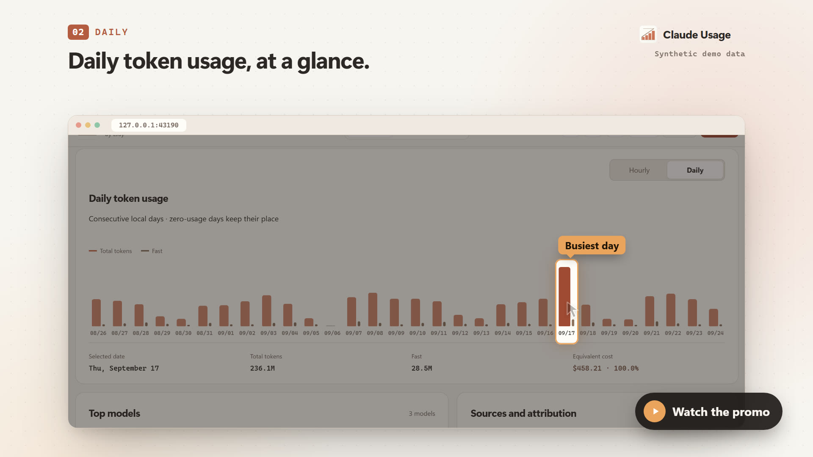

# Dashboard recordings / 界面演示

These recordings use the repository's embedded Dashboard with `scripts/demo-api.js`. All sessions, counters, source paths and exports are synthetic. No local Claude transcripts, credentials or personal usage are read. Capture fails on page errors, unexpected external requests or accounting/error banners.

动图使用实际页面交互，按录制时的原始时序播放，未加速。光标移动约 420–850 ms，点击后至少停顿 650 ms，搜索逐字输入间隔 140 ms，每个章节另留 2 秒阅读时间。GIF 和 MP4 的时长会自动核对；静止画面通过帧去重节省体积，保留原有停顿。

## Files

| File | Content |
|---|---|
| [claude-usage-demo.gif](claude-usage-demo.gif) | 中文实速动图，99.04 秒、1120 px 宽、最高 20 fps |
| [claude-usage-demo-en.gif](claude-usage-demo-en.gif) | English walkthrough, 98.12 seconds at original speed |
| [claude-usage-demo-zh.mp4](claude-usage-demo-zh.mp4) | 中文高清录屏，1440 × 1000 |
| [claude-usage-demo-en.mp4](claude-usage-demo-en.mp4) | English full-resolution recording, 1440 × 1000 |
| [social-preview.png](social-preview.png) | 暖色项目分享封面，1280 × 640 |

## Walkthrough

Overview → a 90-minute query → hourly drilldown → daily calendar → project breakdown → task tree and collapse/expand → Session search → combined Fast/model filters → JSON/CSV choices and an actual synthetic CSV download → Windows/WSL sources → model and cache-lifetime prices → display preferences → dark theme → language switch.

## Reproduce

Requires Node.js, Playwright Chromium, `ffmpeg` and `ffprobe` on `PATH`.

```sh
npm ci
npx playwright install chromium
npm run capture:media
```

Optional `MEDIA_LOCALE=zh-CN` or `MEDIA_LOCALE=en` records only one language. The static server uses a free loopback port and a temporary browser profile. The script shuts them down after capture. It does not install claude-usage or add startup entries.

Chapter screenshots, timing audits and the sample CSV are written to ignored `dist/media-review/<locale>/`. Published assets contain only the synthetic demo. Screenshot-only capture is available through `npm run capture:screenshots` after `npm run build:demo`.

## Promo film / 宣传片

`npm run capture:promo` renders a 64-second promotional film in Chinese and English, in landscape and vertical cuts:

- `claude-usage-promo-zh.mp4` and `claude-usage-promo-en.mp4`: 1920 × 1080, 30 fps, H.264 + AAC.
- `claude-usage-promo-zh-vertical.mp4` and `claude-usage-promo-en-vertical.mp4`: 1080 × 1920 for short-video platforms.
- `claude-usage-promo-poster.jpg` and `claude-usage-promo-poster-en.jpg`: landscape posters with a play badge.

[](claude-usage-promo-en.mp4)

The film opens with a question and the brand, then shows eleven features, one idea per shot:

1. Totals and cost, with cache reads, cache writes, and Thinking itemized
2. The last 30 days of daily usage
3. Hourly usage
4. A minute-precision range since the last five-hour reset
5. The calendar with its Standard / Fast split
6. Breakdowns by model and project
7. Session search
8. The task tree
9. Windows + WSL source merging
10. Export, live usage updates, and software updates
11. Theme, language, and mobile layout

It closes with the privacy promise and the command to start.

Each shot uses the same devices. The camera settles on one area, the rest of the page dims, a label names what matters, and a cursor performs the click that leads to the next still.

The film uses its own synthetic ledger, `?scenario=promo` in `scripts/demo-api.js`:

- About 2.64B tokens and $5,200 of API-equivalent cost over 30 days, dominated by cache reads.
- Opus 5.5, Sonnet 5, and Haiku 4.5, with Fast usage on Opus only.
- A Windows source plus Ubuntu and Debian WSL sources.
- Seven projects, task-like Session titles in the viewer's language, and Subagent trees.
- A mock "update available" state.

The default online demo and its tests are unchanged.

The pipeline runs offline:

1. `scripts/promo/assets.mjs` captures 2× Dashboard stills for every beat, together with the rectangles that the camera, spotlight, labels, and cursor are anchored to. The portrait cut uses a 1000 × 1150 Dashboard viewport. The demo notice banner is left out of the stills; the film carries its own "synthetic demo data" label instead.
2. `scripts/promo/promo.html`, `promo.css`, and `promo.js` compose the scenes from a beat sheet. `internal/web/static/icon.svg` supplies the same selected A icon used by the Dashboard, browser icons and README; `npm run build:icons` exports its PNG variants. Every frame is a pure function of time, so `scripts/capture-promo.mjs` seeks frame by frame and pipes lossless screenshots into FFmpeg.
3. `scripts/promo/music.mjs` synthesizes a license-free soundtrack in Node and normalizes it to −16 LUFS with FFmpeg's two-pass `loudnorm`.

`scripts/promo/timeline.json` is the single source of scene timing for picture and sound. Several environment variables help when rendering or iterating:

- `MEDIA_LOCALE=zh-CN|en` and `PROMO_FORMAT=landscape|vertical` render a single version.
- `PROMO_PREVIEW=1` writes only one review still per second, plus the posters.
- `PROMO_ASSETS=<dir>` caches the captured stills between runs.

Rendering checks each MP4's resolution, frame count, duration, audio stream, and size. Review stills and `render.json` go to the ignored `dist/promo-review/`.
